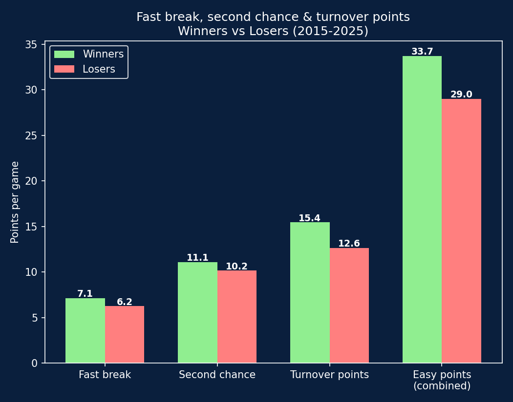
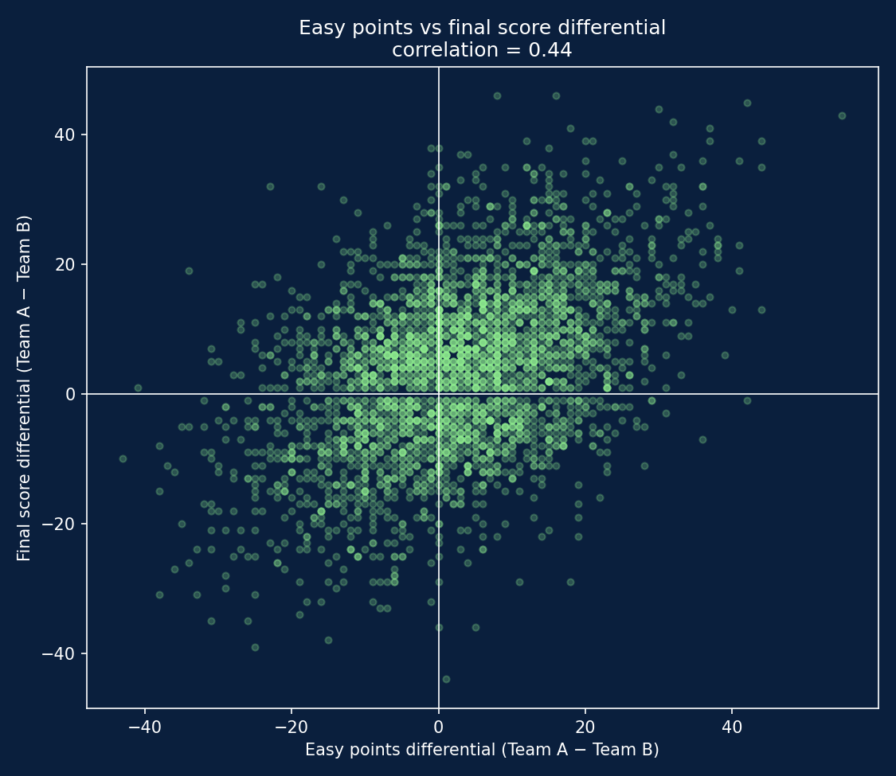

# Easy Points: Do Fast Breaks, Second Chances and Turnovers Actually Win Games?

A team-level data analysis testing a common basketball intuition: do "easy" points — fast breaks, second chance opportunities, and points off turnovers — actually make the difference between winning and losing in EuroLeague?

## Background

Coaches talk a lot about "easy points": transition buckets, offensive rebounds converted into second attempts, points scored off a forced turnover. The intuition is that these possessions matter more than their raw point value suggests, since they come with little defensive resistance and often reflect a team playing with energy and control.

This project tests that intuition directly using box-score-level data: **do teams that generate more easy points actually win more often, and how strong is that relationship really?**

## Data & Tools

- **Data source**: [Euroleague & Eurocup Datasets](https://www.kaggle.com/datasets/babissamothrakis/euroleague-datasets) (Kaggle) — specifically `euroleague_comparison.csv` (team-level fast break, second chance, and turnover points per game) and `euroleague_header.csv` (final scores)
- **Tools**: Python, pandas, matplotlib
- **Scope**: 3,298 EuroLeague games, seasons 2015-16 through 2025-26 (`E2015`-`E2025`)

## Defining "Easy Points"

"Easy points" is defined here as the sum of three box-score categories already tracked per team, per game:

- **Fast break points** — scored in transition
- **Second chance points** — scored after an offensive rebound
- **Turnover points** — scored off a forced opponent turnover

The analysis first looked at fast break and second chance points alone. That version showed only a weak relationship with winning (correlation of 0.27 with final score differential), which raised the question of whether turnover points — often the most "unearned" of the three — would meaningfully change the picture. They did, and by a wide margin, so the final metric combines all three.

Before drawing any conclusions, the underlying data was checked for missing values across all three categories, for every season in scope. None were found — the dataset is complete for 2015-2025, so the results below aren't an artifact of patchy data in older seasons.

## Results

| | Fast break | Second chance | Turnover points | Easy points (combined) |
|---|---|---|---|---|
| **Winners** | 7.14 | 11.09 | 15.44 | **33.68** |
| **Losers**  | 6.24 | 10.15 | 12.62 | **29.01** |

Winners outscore losers in all three categories, but not by the same margin. Turnover points show the largest gap (+2.82 points/game) — noticeably bigger than fast break (+0.90) or second chance (+0.94). This suggests that forcing turnovers and converting them is the single most discriminating habit among the three, more so than transition offense or offensive rebounding alone.

- **Correlation between easy points differential and final score differential: 0.44** (moderate). Including turnover points nearly doubled this correlation compared to fast break + second chance alone (0.27), confirming that turnover points carry most of the explanatory power in this metric.
- **The team with more combined easy points wins the game 64.4% of the time** (ties in easy points excluded — 163 games). That's well above a coin flip, but still means more than 1 in 3 games are won by the team with fewer easy points.

## Takeaways

- **Not all "easy points" are equally easy to win with.** Turnover points are the strongest of the three individual categories — a much bigger gap between winners and losers than fast break or second chance points show on their own.
- **The combined metric has real predictive value, but it's not dominant.** A 0.44 correlation and a 64.4% leader-win-rate indicate a genuine, moderate relationship — not proof that easy points decide games by themselves. Basketball has too many moving parts (shooting variance, free throws, half-court execution) for any single stat to fully explain the outcome.
- **This likely reflects team quality more than a standalone lever.** Teams that generate a lot of easy points are often also good in transition defense, rebounding, and ball pressure — the easy points may be a symptom of overall team strength rather than an isolated cause of winning.

## How to Reproduce

1. Download the [Euroleague & Eurocup Datasets](https://www.kaggle.com/datasets/babissamothrakis/euroleague-datasets) from Kaggle
2. Place `euroleague_comparison.csv` and `euroleague_header.csv` in a `csv_euroleague` folder, one level above this project's folder
3. Run the analysis script (requires `pandas`, `matplotlib`)

## About

This project combines a background in basketball coaching (8 years, youth and regional level) with data analysis.